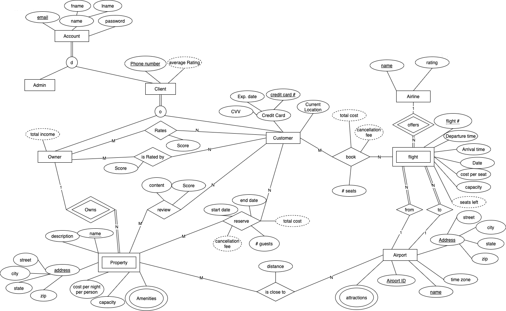

## Atlanta Travel Reservation System

#### DESCRIPTION
We designed and implemented an online travel reservation system allowing 10 different kinds of users to do operations based on their authority in MySQL.

#### PROJECT PHASES

The project is splited into 4 phases: EERD design, relational schema implementation, creation of views and procedures, and application development.

#### EERD CHART

The following chart shows the Enhanced Entity Relationship Diagram (EERD) of our database.

#### EXPOSURES

- mySQL
- Python
- Flask
- HTML/CSS
- Javascript
- Bootstrap